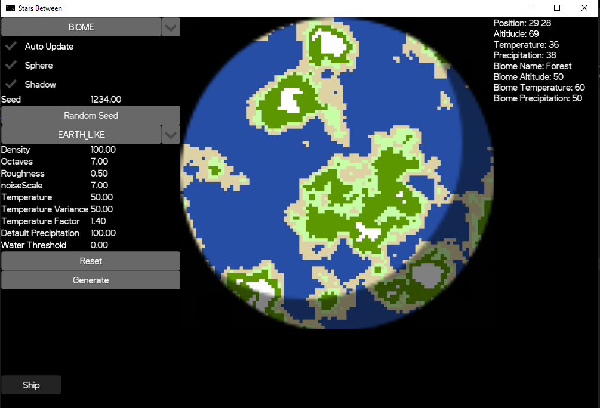

# Stars Between

[](https://github.com/ManApart/stars_between/actions/workflows/runTests.yml)

Explore Space

[](https://austinkucera.com/games/stars-between)

## Running

```
runJvm
runJs
jsBrowserDistribution
```

## Pushing to web

```
aws s3 sync build/distributions/ s3://austinkucera.com/games/stars-between-2/


./gradlew jsBrowserDistribution && aws s3 sync build/distributions/ s3://austinkucera.com/games/stars-between-2/
```


### Other
If the app complains that Swagger Config needs to be open, enable annotation processing in Intellij

View the swagger at `http://localhost:8080/swagger-ui.html`

### TODO

### Examples



